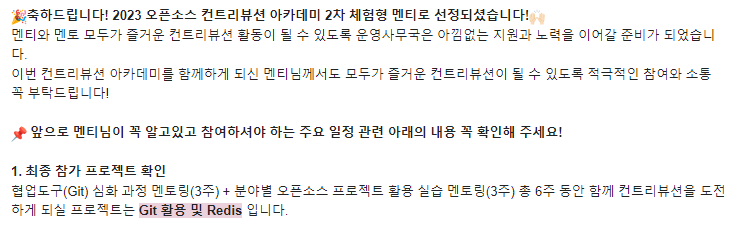

## ossca 체험형 멘티 선정
[https://www.contribution.ac/](https://www.contribution.ac/)
학부 홈피 공지사항을 보다가 2023 ossca 2차 체험형 멘티를 모집한다고 해서 지원했다.
예전부터 관심이 있던 활동이었는데 슬프게도 군대에 있어서 못했다가 이번에 보고 바로 지원서를 보냈다.



체험형 멘티는 참여형 멘티 보다는 오픈소스에 직접 기여 보다는 개발 경험이 거의 없는 사람을 교육 목적으로 하는 느낌인 것 같다.
프로그램은 3주동안 Git에 대해 배우고 3주동안 오픈소스 프로젝트 활용 실습 멘토링을 한다고 나와있다.

내가 지원한 프로젝트는 Git 활용 및 Redis로, 예전에 했던 프로젝트 중 mongoDB를 사용한 프로젝트가 있었는데 nosql구조에 대해 더 자세히 알고 싶어 이 프로젝트를 선택했다.
그래서 결론은 ossca에 참여하면서 과제를 하는 과정을 매 주 블로그에 올리려고 한다. <strike>포스팅 주제 날먹</strike>

## Git 명령어 정리
일단 기본적인 Git 명령어를 다시 한 번 상기하면서 정리해봅시다. Git 명령어 전체 레퍼런스는 [https://git-scm.com/docs](https://git-scm.com/docs)에서 확인할 수 있다.

### config
``` sh
git config --global user.name "[name]"
git config --global user.email "[email]"
```
commit할 때 이름과 이메일이 없으면 에러가 발생해서 먼저 새로 깃을 설치하면 이름과 이메일 설정부터 해 줘야 한다.

### init
``` sh
git init <project-name>
```
새로운 로컬 저장소를 만들고 이름을 project-name으로 한다.

### clone
``` sh
git clone <url>
```
url에 있는 저장소를 로컬에 가져온다.

### remote
``` sh
git remote add <alias> <url>
```
url으로 원격 저장소를 등록하고 alias라는 이름을 갖게 한다.

### branch
``` sh
git branch (-d) <branch-name>
```
새로운 branch를 branch-name으로 만든다. -d 옵션은 branch-name을 가지는 branch를 삭제한다.

### switch
``` sh
git switch (-c) <branch-name>
```
branch-name branch로 전환한다. -c 옵션은 branch-name이름을 가지는 branch가 없었을 경우 생성한다.

### add
``` sh
git add <file>
```
변경사항이 있는 경우 다음 commit을 준비하기 위해 파일을 임시 저장(stage)한다.

### commit
``` sh
git commit -m "[message]"
```
stage된 모든 내용을 commit message와 함께 저장한다.

### push
``` sh
git push <remote> <branch>
```
모든 로컬 브랜치의 commit을 원격 저장소(Github 등)에 업로드한다.

### fetch
``` sh
git fetch <remote> <branch>
```
원격 저장소의 변경된 commit을 임시 branch로 가져온다. working directory에는 영향을 주지 않는다.

### merge
``` sh
git merge <remote> | <branch>
```
remote 혹은 branch에서 변경사항을 들고와 working directory와 합친다.

### pull
``` sh
git pull <remote> <branch>
```
간단하게 말해 fetch + merge와 같은 기능을 한다. 주어진 인자로 git fetch를 실행시키고 설정 혹은 command line flag에 따라 git rebase 혹은 git merge를 사용해 현재 working directory를 업데이트한다.

### cherry-pick
``` sh
git cherry-pick <commit hash>
```
특정 commit지점에서 변경사항을 merge한다. merge 명령어와 다른 점은 merge는 항상 branch의 HEAD만 가져오지만 cherry-pick은 branch의 특정 commit을 지정해서 가져올 수 있다.