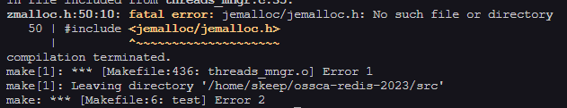
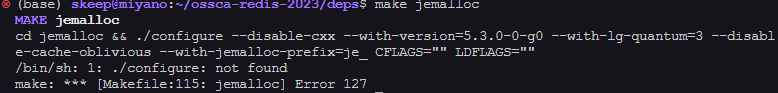
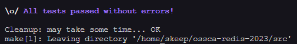

## 환경
window 11 + WSL2 with Ubuntu 22.04

## 빌드해보자!
redis 프로젝트를 클론해와서 빌드했다.

```sh
make
make test
```

결과는..?



jemalloc가 없다고 나온다. 인터넷에 검색해보니 deps폴더로 가서 make jemalloc를 하라고 한다.



아.. 이번엔 configure가 없다고 한다. 한참 뒤져봤지만 결론은 jemalloc폴더로 가서 autogen.sh를 실행하면 된다.

```sh
./autogen.sh
```

다시 make jemalloc를 하고 프로젝트 루트 폴더로 가서 빌드 테스트를 해보니 잘 작동한다.

## 성공!
