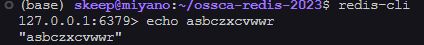
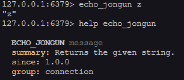

## echoCommand
redis cli에는 echo명령어가 있다. redis 프로젝트 구조를 보고 echo명령어를 똑같이 만들어보자.



일단 redis command는 src/commands 밑에 .json 형태로 저장되어 있다. utils/generate-command-code.py에 json 파일을 읽어서 commands.def를 만드는 부분이 있다.

<CH.Code>
```python generate-command-code.py
# line 536
# Create all command objects
print("Processing json files...")
for filename in glob.glob('%s/commands/*.json' % srcdir):
    with open(filename, "r") as f:
        try:
            d = json.load(f)
            for name, desc in d.items():
                create_command(name, desc)
        except json.decoder.JSONDecodeError as err:
            print("Error processing %s: %s" % (filename, err))
            exit(1)
```
</CH.Code>

## echo.json
그래서 echo.json 파일을 보고 똑같은 형식으로 echoJongun.json을 추가해줬다.

<CH.Code>
```json echo.json
{
    "ECHO": {
        "summary": "Returns the given string.",
        "complexity": "O(1)",
        "group": "connection",
        "since": "1.0.0",
        "arity": 2,
        "function": "echoCommand",
        "command_flags": [
            "LOADING",
            "STALE",
            "FAST"
        ],
        "acl_categories": [
            "CONNECTION"
        ],
        "reply_schema": {
            "description": "The given string",
            "type": "string"
        },
        "arguments": [
            {
                "name": "message",
                "type": "string"
            }
        ]
    }
}
```
```json echo-jongun.json
{
    "ECHO_JONGUN": {
        "summary": "Returns the given string.",
        "complexity": "O(1)",
        "group": "connection",
        "since": "1.0.0",
        "arity": 2,
        "function": "echoJongunCommand",
        "command_flags": [
            "LOADING",
            "STALE",
            "FAST"
        ],
        "acl_categories": [
            "CONNECTION"
        ],
        "reply_schema": {
            "description": "The given string",
            "type": "string"
        },
        "arguments": [
            {
                "name": "message",
                "type": "string"
            }
        ]
    }
}
```
</CH.Code>

function 부분이 아마 server.c에 있는 커맨드 함수 이름인 것 같다.

server.c에 함수를 추가해줬다.
<CH.Code>
```c server.c
void echoJongunCommand(client *c) {
    addReplyBulk(c,c->argv[1]);
}
```
</CH.Code>

server.h에도 함수 정의를 추가했다.
<CH.Code>
```c server.h
void echoJongunCommand(client *c);
```
</CH.Code>

## 완성!
make로 다시 빌드를 하고 실행해보니 추가한 커맨드가 잘 동작한다.

