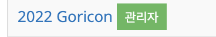
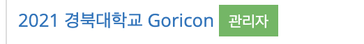
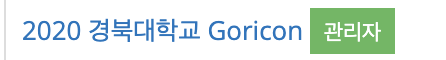
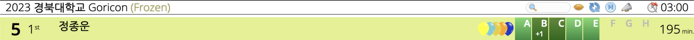

## 4년만에 출제자에서 참가자로
19년도, 대학 신입생 시절 교내대회 Goricon을 통해 ps에 입문했었다. 당시에는 icpc처럼 팀 대회였고 나는 동기 둘과 같이 나갔었다.
그 당시에는 C언어 문법을 겨우 다 아는 초심자여서 3문제를 풀었고 거의 꼴지를 했다..

그 후 20년도에 Gori 회장을 맡게 되어 Goricon 문제를 출제했고 21, 22년도에는 무려 군대에서 교내대회를 출제했다.

그래서 이번년도 대회가 사실상 ps를 시작하고 처음으로 참여하는 교내대회가 되었다.

## 더 잘하고 싶었는데
프리즈 전 5솔 1등이었다. F번이 좀 어려워보여서 G로 갔는데 결국 G를 못풀고 F를 두명이나 풀어서 3등으로 밀려났다.
G를 지문을 잘못 읽는 실수를 했지만 아마 맞았어도 프리즈 후 F가 더 빨리 풀려서 1등은 물건너갔다고 생각한다.
최근 코드포스 퍼플을 달성하고 나름 ps에 자신이 좀 있었다고 생각했는데 아직 갈길이 너무 멀다고만 느껴지는 대회였다.

프리즈된 스코어보드.. 잠깐이지만 1등이었다.

대회때 사실 긴장을 너무 해서 손을 벌벌 떨면서 코딩했다. 지문을 잘못 읽은 것도 그것 때문인 것 같고 1등을 하고 싶다는 마음이 너무 세게 박혀있으니까 이게 압박감으로 작용한게 좀 컸나보다.

앞으로 졸업까지는 2년 더 남았는데 성과나 수상에 너무 미련을 가지면 괜히 혼자 힘들어지니까 슬슬 마음을 좀 놓을 때가 온 것 같다.

<s>ps는 게임이니까 그낭 즐기자고요</s>

## 풀이
### A
사칙연산을 할 줄 아는지 물어보는 문제였다. <MathBlock math="(a+b+c+d)*4 >= n"/>  끝.

### B
브루트포스로 000~999까지 찾아보면서 소수소수인게 하나라도 있으면 가운데 자리 숫자를 반복해서 사용하면 된다. 처음에 구현이 말려서 한번 틀렸다..

### C
스택을 오름차순으로 유지하자. 1번 쿼리가 들어오면 스택에 넣고 2번 쿼리가 들어오면 스택에서 잘린 통나무보다 작거나 같은 통나무를 전부 빼서 하나로 묶어줄 수 있다.

마지막에 길이와 묶인 통나무의 개수를 전부 더해주면 된다.

### D
슬라임을 합칠 때 큰 슬라임의 크기가 <MathBlock math="K"/>라고 하면 항상 <MathBlock math="1"/>에서 <MathBlock math="K"/>의 크기가 될 때 까지 순서대로 합치는 방법이 존재한다.

따라서 분리 집합으로 슬라임을 합쳐가면서 분리 집합의 각 크기를 <MathBlock math="A_i"/>라고 하면 답은 <MathBlock math="\sum_1^N{A_i*(A_i-1)/2}"/>가 된다.

이를 각 슬라입이 합쳐질 때 마다 합쳐지는 슬라임에 대해서만 따로 빼고 더해주면 된다.

### E
호반우가 올라갔다가 내려갔을 때 높이의 변화량을 기준으로 내림차순 정렬한다. 끝.

답이 바뀌는 과정을 보면 높이의 변화량만큼 뒤에 모든 답이 변하므로 무조건 높이의 변화량이 큰게 앞에 와야한다. 결국 높이의 변화량이 0이라고 가정했을 때는 한 번 올라갔을 때가 답에 더해지는데 이를 조절하는게 높이의 변화량이기 때문.

변화량을 제외한 올라가고 내려가는 수치는 의미없다는 것을 알 수 있다.

## 결론
진짜 더 잘하고 싶다. 잘하고 싶은데..

어제는 사실 멘탈이 좀 위험해서 ps를 접는다 만다 하고 다녔는데 그래도 ps는 재밌으니까.. 학교 다니면서 대회에 참여할 수 있을 때 까지만이라도 열심히 해보기로 했다.