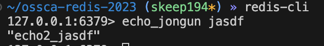

## echo2
저번시간에 만든 `echo_jongun` 명령어를 변형시켜서 출력으로 입력을 그대로 돌려주는 것이 아닌 echo2_를 접두사로 붙여 출력해보자.

## echoCommamd
```c server.c
void echoCommand(client *c) {
    addReplyBulk(c,c->argv[1]);
}
```
이 함수를 보면 매개변수로 받은 인자를 `addReplyBulk`함수에 넣어주고 있는 것을 알 수 있다.

이부분을 적절히 변형해서 만들어보자.

## sds
일단.. 멘토님이 던져준 키워드는 `sds`, `addReplyBulkSds`, `sdsempty`, `sdscatfmt`였다. 각 구조체와 함수를 하나씩 뜯어보면서 어떤 역할을 하는지 알아보자.

redis 프로젝트에는 C문자열을 `sds`라는 이름으로 정의해서 사용한다. 이는 `sds.h` 파일에 정의되어 있다.

```c sds.h
typedef char *sds;
```

`sdsempty`는 주석을 읽어보면 빈 `sds`를 반환한다고 적혀있다.

```c sds.c
/* Create an empty (zero length) sds string. Even in this case the string
 * always has an implicit null term. */
sds sdsempty(void) {
    return sdsnewlen("",0);
}
```

`sdscatfmt`함수는 함수명과 주석에서 유추해보면 `strcat`와 `sprintf`를 합쳐놓은 듯한 함수고 비슷한 방법으로 사용할 수 있어보인다.

구현 부분을 읽어보니까 이 함수의 스펙은 `sds`와 포맷을 입력받아 원본 문자열 뒤에 포맷 스트링을 붙여서 반환하는 함수다.

처음에 오해했던 부분은 `sds`자체로 side effect가 발생해 문자열이 수정되는 줄 알았는데 자세히 읽어보니 인자로 준 `sds`를 건드리지 않고 새로 만들어서 반환한다.

```c sds.c
/* This function is similar to sdscatprintf, but much faster as it does
 * not rely on sprintf() family functions implemented by the libc that
 * are often very slow. Moreover directly handling the sds string as
 * new data is concatenated provides a performance improvement.
 *
 * However this function only handles an incompatible subset of printf-alike
 * format specifiers:
 *
 * %s - C String
 * %S - SDS string
 * %i - signed int
 * %I - 64 bit signed integer (long long, int64_t)
 * %u - unsigned int
 * %U - 64 bit unsigned integer (unsigned long long, uint64_t)
 * %% - Verbatim "%" character.
 */
sds sdscatfmt(sds s, char const *fmt, ...) 
```

`addReplyBulkSds`함수는 주석을 읽어보면 알수있듯이 `sds`를 입력으로 받아 출력해주는 것으로 보인다.

주의점으로 이 함수가 실행된 후 원본 `sds`는 메모리 할당 해제가 된다고 한다.

```c network.c
/* Add sds to reply (takes ownership of sds and frees it) */
void addReplyBulkSds(client *c, sds s)  {
    addReplyLongLongWithPrefix(c,sdslen(s),'$');
    addReplySds(c,s);
    addReplyProto(c,"\r\n",2);
}
```

## 고민거리
입력으로 들어오는 값이 `c->argv[1]`인건 확실한데 얘의 타입은 `robj*`다. `sdscatfmt`함수에 넣어주려면 `sds`문자열이 필요한데 어떻게 해야하는지 코드의 다른 부분을 참고했다.

그래서 `addReply`함수를 살펴봤다.

```c server.c
/* Add the object 'obj' string representation to the client output buffer. */
void addReply(client *c, robj *obj) {
    if (prepareClientToWrite(c) != C_OK) return;

    if (sdsEncodedObject(obj)) {
        _addReplyToBufferOrList(c,obj->ptr,sdslen(obj->ptr));
    } else if (obj->encoding == OBJ_ENCODING_INT) {
        /* For integer encoded strings we just convert it into a string
         * using our optimized function, and attach the resulting string
         * to the output buffer. */
        char buf[32];
        size_t len = ll2string(buf,sizeof(buf),(long)obj->ptr);
        _addReplyToBufferOrList(c,buf,len);
    } else {
        serverPanic("Wrong obj->encoding in addReply()");
    }
}
```

`sds`문자열인 경우 `obj->ptr`으로 얻어올 수 있어 보인다. `else` 부분의 `obj->encoding`이 정수형일 때 다르게 처리하는 부분이 있는데 일단 우리가 입력으로 준 값은 문자열이니까 `sds`문자열이 그대로 들어오는게 맞아보였고 `sdscatfmt`의 마지막 인자로 `c->argv[1]->ptr`을 넣어줬다.

## 합쳐보기
이제 이 함수들을 살펴봤으니까 해야하는건 `sdsempty`함수로 빈 `sds`문자열을 만들고 `sdscatfmt`함수로 `echo2_`접두사를 붙인 후 `addReplyBulkSds`함수로 출력하면 된다.

전에 만들었던 `echoJongunCommand`함수를 고쳐보자.

```c server.c
void echoJongunCommand(client *c) {
    sds echo = sdsempty();
    echo = sdscatfmt(echo, "echo2_%S", c->argv[1]->ptr);
    addReplyBulkSds(c, echo);
}
```

## 완성!
