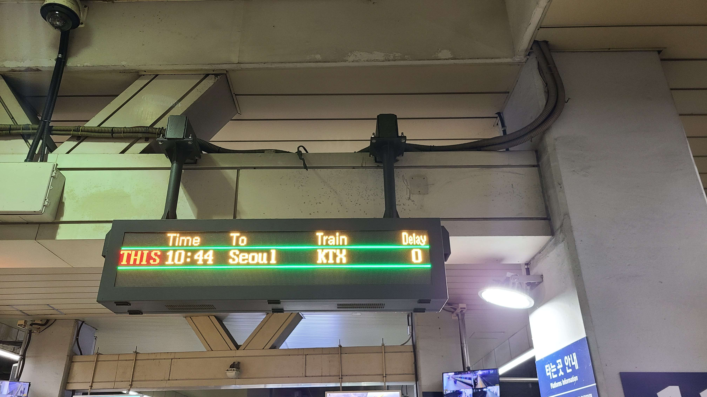
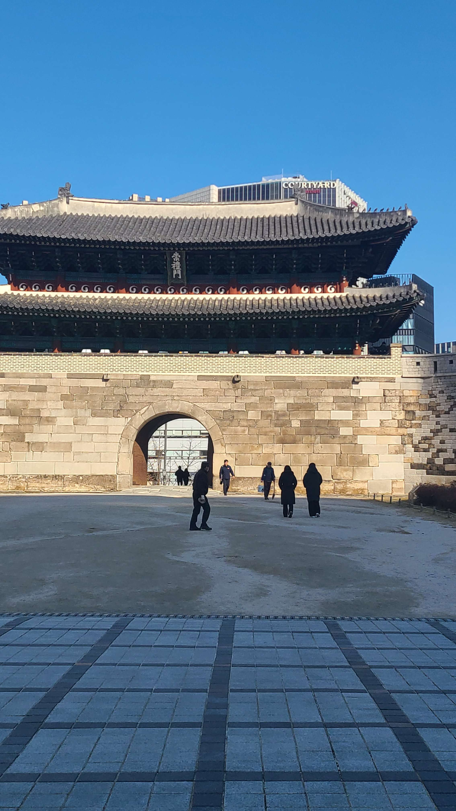
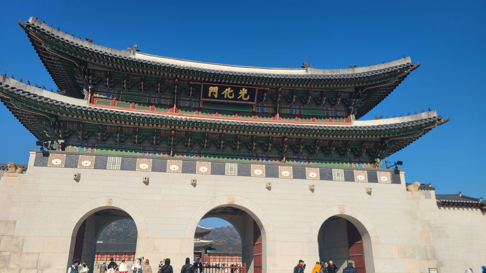
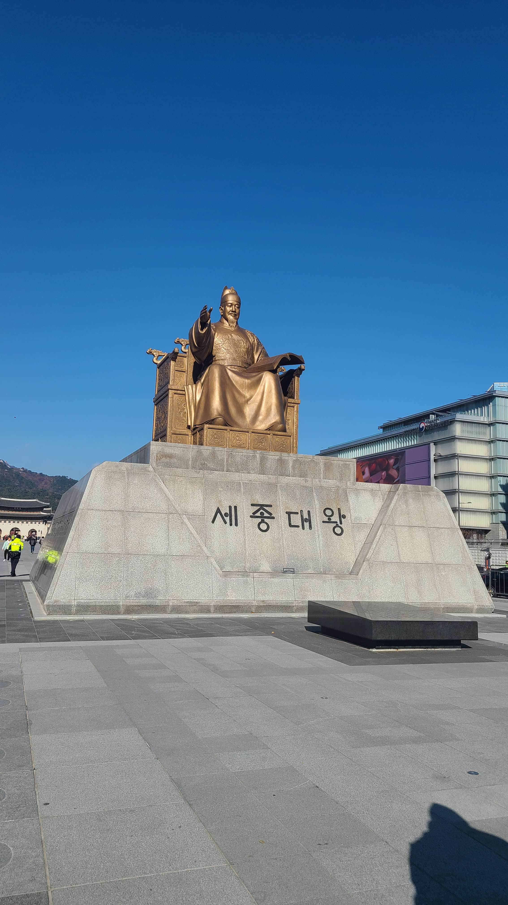
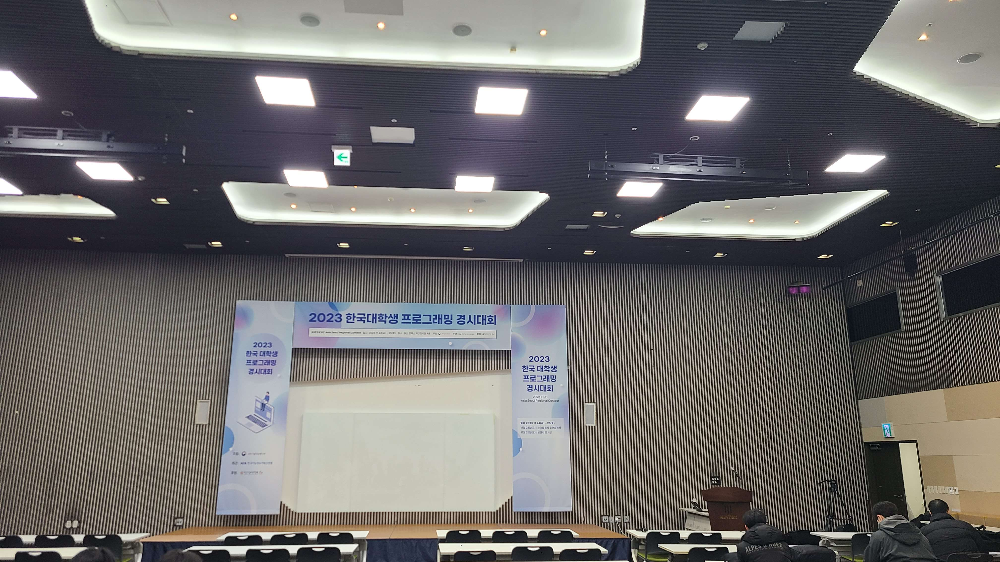
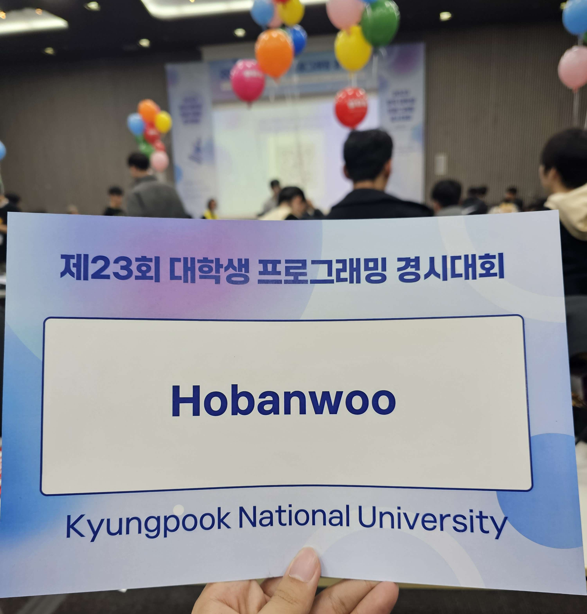
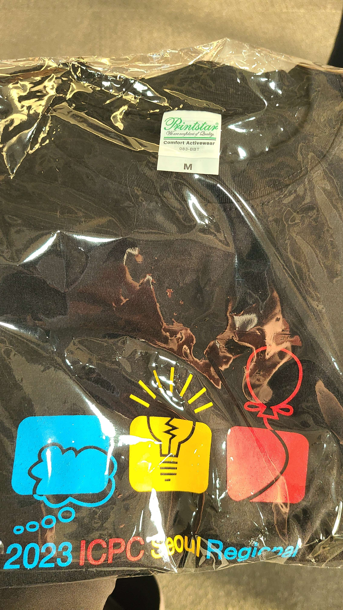
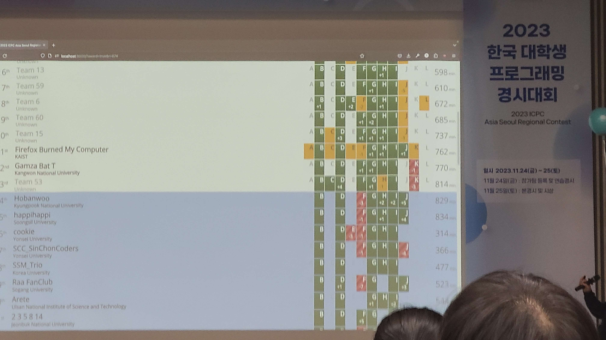
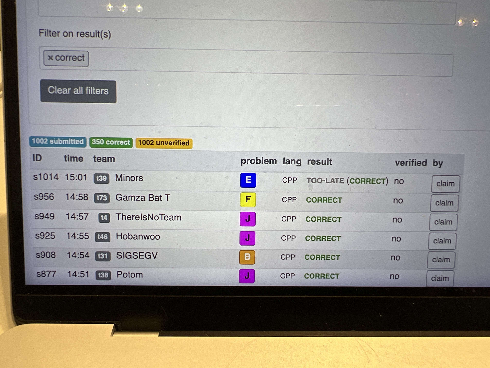
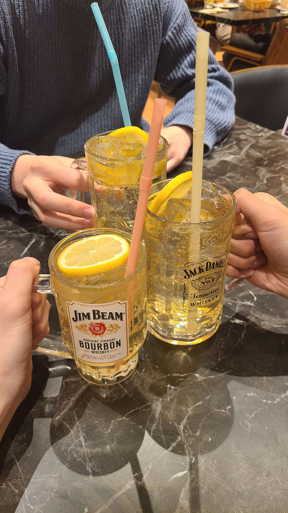

## 본선
예선 때 23등으로 본선에 진출했다. 처음 가보는 서울 리저널 컨테스트여서 상당히 두근거렸고 수상에 대한 기대감도 살짝 있었다.
이번에 본대회는 일산 킨텍스에서 진행되었다. 동대구에서 일산까지 가는게 대회보다 더 힘들었던 것 같다..

도착해서 잠깐 서울 구경도 했다!

숭례문..광화문..어쨌든 서울에는 문이 많나보다.

세종대왕상도 보고왔다.

팀노트랑 재학증명서를 미리 출력 안하고 와서 급하게 근처 복사집에서 뽑고 택시로 킨텍스에 도착했다.

## 대회장
서울 리저널은 이틀동안 진행한다. 금요일은 예비소집일로 재학증명서, 팀노트, 키보드 등을 제출한다.
대회 끝나고 든 생각이었는데 다음 대회때는 꼭 키보드를 들고와야겠다고 생각했다.
대회장에 있는 키보드가 영 마음에 들지 않았다..
그리고 팀노트도 꼼꼼히 채워가는게 좋겠다고 생각했다. 사실 좀 급하게 만든 감이 없잖아 있어 부족한 내용이 너무 많았다.
`pb_ds`사용법 정도는 넣어야 한다는 것도..!

대회장에 들어오니 팀 이름이 세팅되어 있었다.

**Hobanwoo!!**

최종적으로 대회 환경과 컴파일 옵션 등을 점검하고 티셔츠랑 에코백을 나눠준 후 예비소집은 끝났다.

이쯤 되면 ps대회에서 받은 티셔츠만 두자리수 정도 되는 것 같다.
~~슬프게도 항상 티셔츠만 받고 상을 못 따는건 달라진 적 없다...~~

## 본선 당일
드디어 대회 본선 당일이 도래했다. 본선은 10시부터 15시까지 총 5시간 12문제로 진행됐다.
우리 팀의 전략은 그냥 스코어보드 보고 따라가는거였다..

이번 서울 리저널에서 우리팀은 총 6문제를 풀었다. 나는 J를 풀었고 B를 푸는데 기여했다.
나머지 문제는 다른 팀원이 너무 잘해준 바람에 사실 구경도 못해서 어떤 문제인지 잘 모른다..

### B
자세한 풀이는 모르지만 $$k$$번째 원소를 빼고 $$k$$번째 원소를 구하는 자료구조가 필요하다길래 `pb_ds`아니면 세그먼트 트리로 되는거여서 그 부분만 내가 짜서 맞았다.

### J
내가 풀어서 맞은 유일한 문제다. 좀 까다로운 digit dp였다. 2, 3, 5, 7이 등장한 개수를 세주고 중간에 0을 사용할 때 무조건 되는 것도 따로 처리하고 6을 사용할 때는 2랑 3이 동시에 올라간다던가 하는 예외로 엄청 애를 먹었다.
구현을 해놓고 뭐가 틀린지 몰라서 한창 해메고 있었는데 팀원이 손으로 열심히 반례를 찾아줘서 겨우 풀었다.

입력 제한이 $$10^{20}$$인 것부터 너무하다고 생각했다. 처음엔 `long long`으로 받아놓고 왜 틀리는지 한참 고민했다.

일단 $$[a, b]$$구간을 $$[1, a-1]$$, $$[1, b]$$로 생각하고 1에서 특정 숫자까지 카운팅하는 digit dp를 두 번 돌려야 한다.

`dp[here][zero][started][t1][t2][t3][t4]`를 정의할 때 지금까지 몇 개의 숫자를 사용했는지, 중간에 0이 한번이라도 사용된 적 있는지, leading zero가 있는지,
2, 3, 5, 7의 개수를 몇 번 셌는지로 상태를 나누고 적절히 전이를 해 주면 된다. 사실 이 적절히라는게 좀 뭐같긴 하다.

## 스코어보드
그래서 최종적으로 우리는 24등을 달성했다.

아쉽게도 한 문제 차이로 수상은 못했지만 많이 풀린 F 풀이를 들어보니 dnc 최적화라고 한다. 또 모르는 알고리즘에 당했다...

그래도 5분 차이로 마지막 J 제출이 통과해서 너무 좋았다.

## 결말
끝나고 서울역에서 치맥을 먹었다. 내년에는 수상할 수 있기를 빌며 Hobanwoo 화이팅!!

